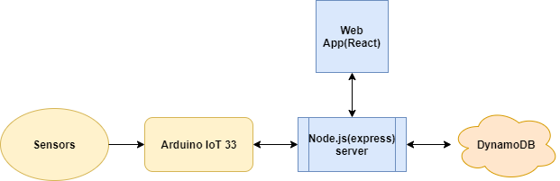

<!-- PROJECT LOGO -->
<br />
<p align="center">
  <a href="https://github.com/itayshaked/ArduinoWateringSystem">
  </a>

  <h3 align="center">Arduino Watering System</h3>

  <p align="center">
    Arduino-Grove based cloud connected watering system
    <br />
    <a href="https://github.com/itayshaked/ArduinoWateringSystem"><strong>Explore the docs »</strong></a>
    <br />
    <br />
    <a href="https://master.d2v2com9v1iunj.amplifyapp.com/">View Demo</a>
    ·
    <a href="https://github.com/itayshaked/ArduinoWateringSystem/issues">Report Bug</a>
    ·
    <a href="https://github.com/itayshaked/ArduinoWateringSystem/issues">Request Feature</a>
  </p>
</p>


<!-- TABLE OF CONTENTS -->
<details open="open">
  <summary><h2 style="display: inline-block">Table of Contents</h2></summary>
  <ol>
    <li>
      <a href="#about-the-project">About The Project</a>
      <ul>
        <li><a href="#built-with">Built With</a></li>
      </ul>
    </li>
    <li>
      <a href="#getting-started">Getting Started</a>
      <ul>
        <li><a href="#prerequisites">Prerequisites</a></li>
        <li><a href="#installation">Installation</a></li>
      </ul>
    </li>
    <li><a href="#usage">Usage</a></li>
    <li><a href="#roadmap">Roadmap</a></li>
    <li><a href="#contributing">Contributing</a></li>
    <li><a href="#contact">Contact</a></li>
  </ol>
</details>


<!-- ABOUT THE PROJECT -->

## About the project

Arduino IoT 33 - Grove shield and sensors based AWS-Cloud connected Automated Watering System with live sensors reading and collection using:


* [Node.js]()
* [React]()
* [DynamoDB]()
* [Apprunner]()
* [Amplify]()
* [Arduino IoT 33]()

## Diagram



<!-- GETTING STARTED -->
## Getting Started

To get a local copy up and running follow these simple steps.

### Prerequisites

Server side:
* npm
  ```sh
  npm i node node-fetch cors express aws-sdk dotenv 
  ```

### Installation

1. Clone the repo
   ```sh
   git clone https://github.com/itayshaked/ArduinoWateringSystem.git
   ```
2. Install NPM packages
   ```sh
   npm i node node-fetch cors express aws-sdk dotenv
3. Run server
   ```sh 
   npm run start
4. Run client
    ```sh
    cd client && npm start
    ```
    


<!-- USAGE EXAMPLES -->
## Usage

Soon will be uploaded.

_For more examples, please refer to the [Documentation](https://example.com)_


<!-- ROADMAP -->
## Roadmap

See the [open issues](https://github.com/github_username/repo_name/issues) for a list of proposed features (and known issues).


<!-- CONTRIBUTING -->
## Contributing

Contributions are **greatly appreciated**.

1. Fork the Project
2. Create your Feature Branch (`git checkout -b feature/AmazingFeature`)
3. Commit your Changes (`git commit -m 'Add some AmazingFeature'`)
4. Push to the Branch (`git push origin feature/AmazingFeature`)
5. Open a Pull Request


<!-- CONTACT -->
## Contact

Itay Shaked - [@LinkedIn](https://www.linkedin.com/in/itayshaked/) - itaysh3r@gmail.com or eitimi@gmail.com

Project Link: [https://github.com/itayshaked/ArduinoWateringSystem](https://github.com/itayshaked/ArduinoWateringSystem)


